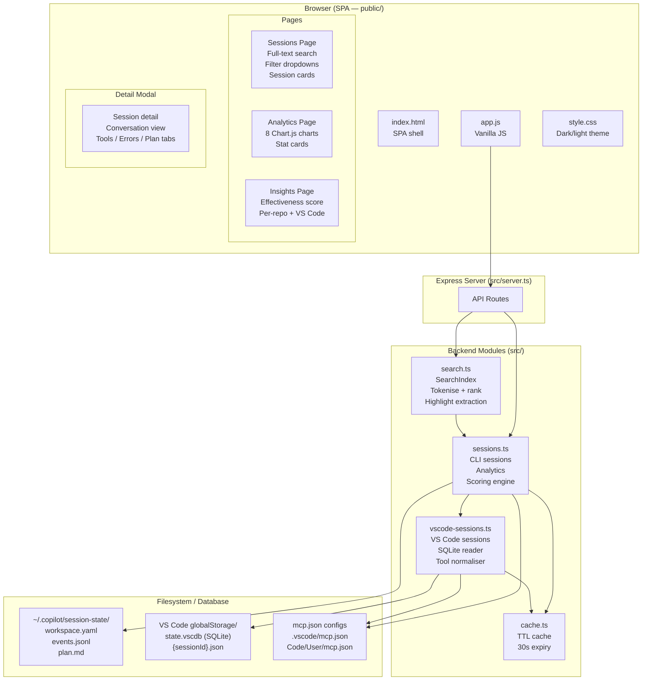
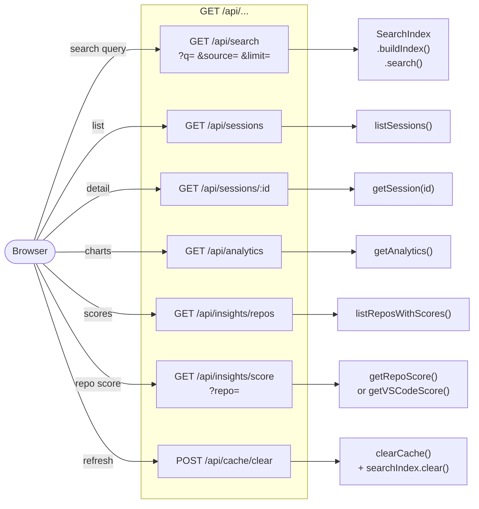
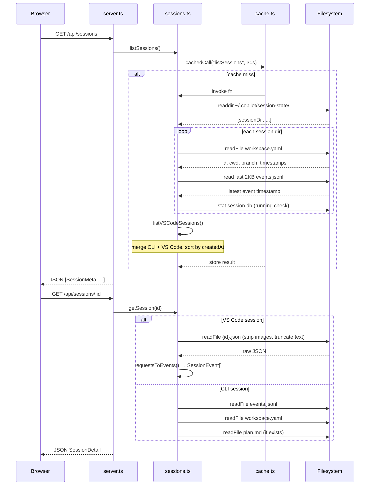
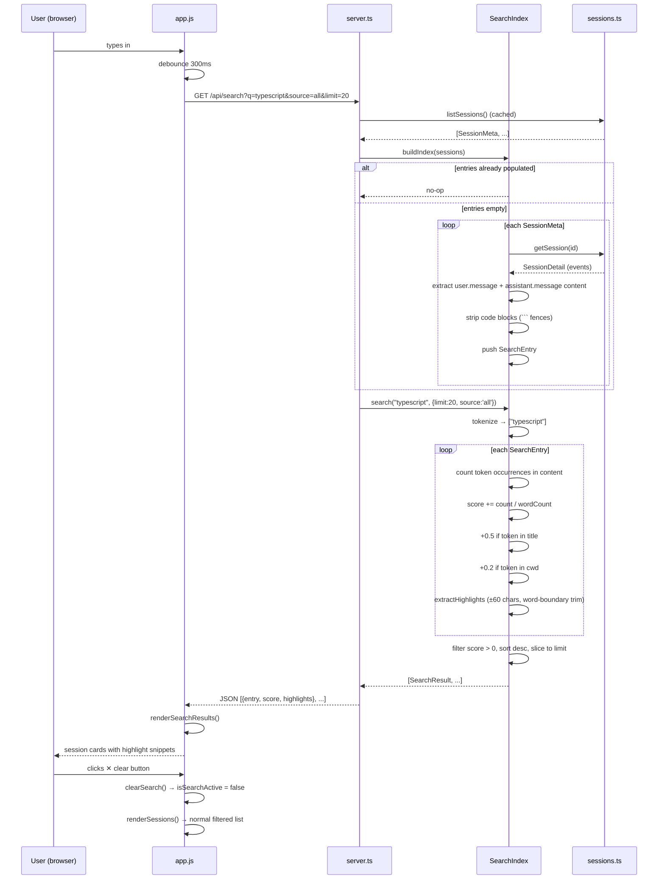
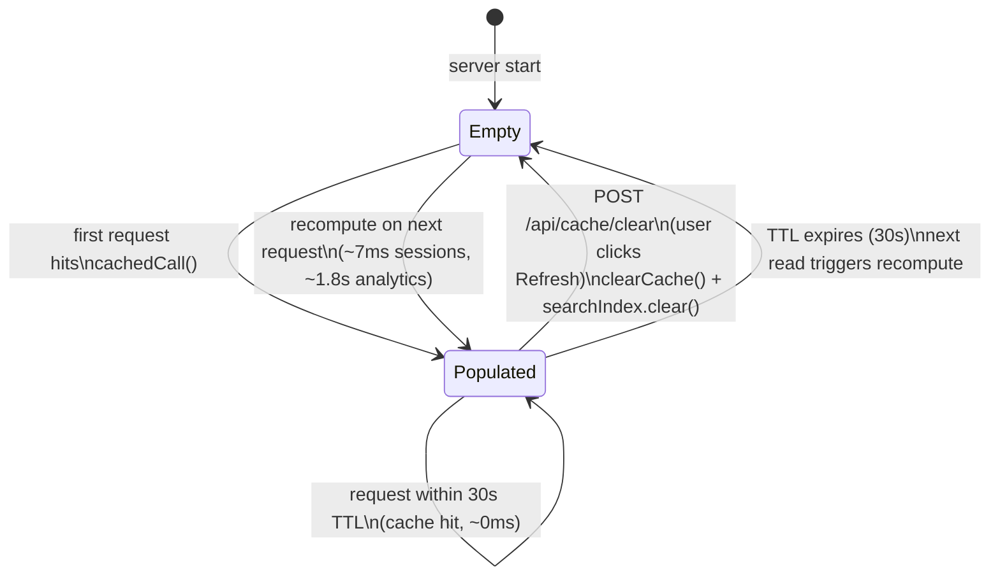
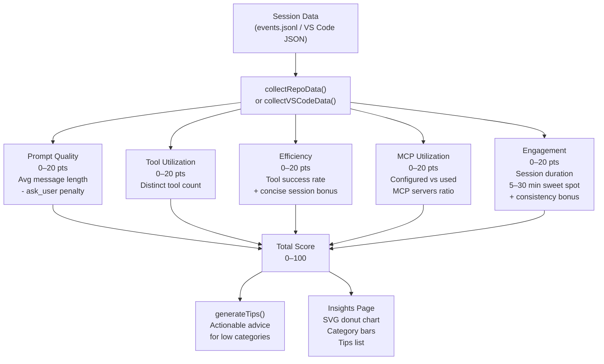
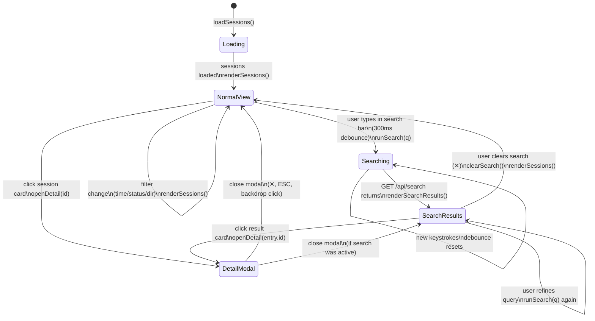
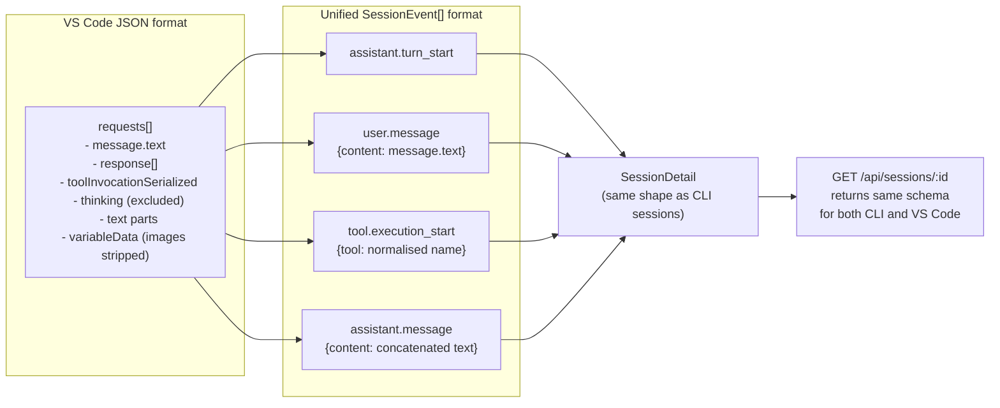

# Copilot Lens — Architecture Diagrams

## System Overview

---

## API Endpoints

---

## Session Data Flow — CLI Sessions

---

## Full-Text Search Flow

---

## Cache Lifecycle

---

## Scoring System

---

## Frontend State Machine — Sessions Page

---

## VS Code Session Data Conversion

