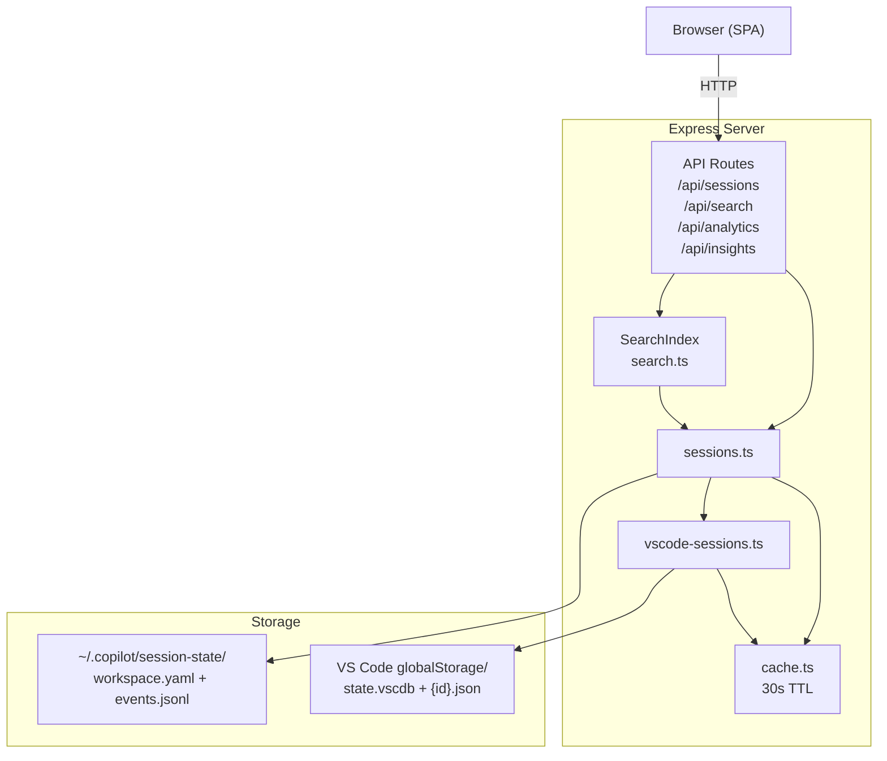
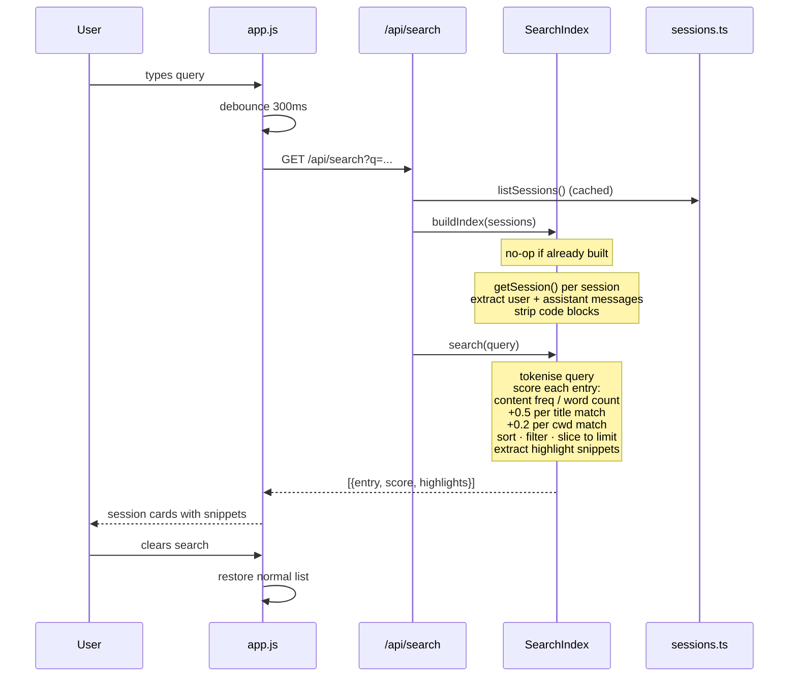
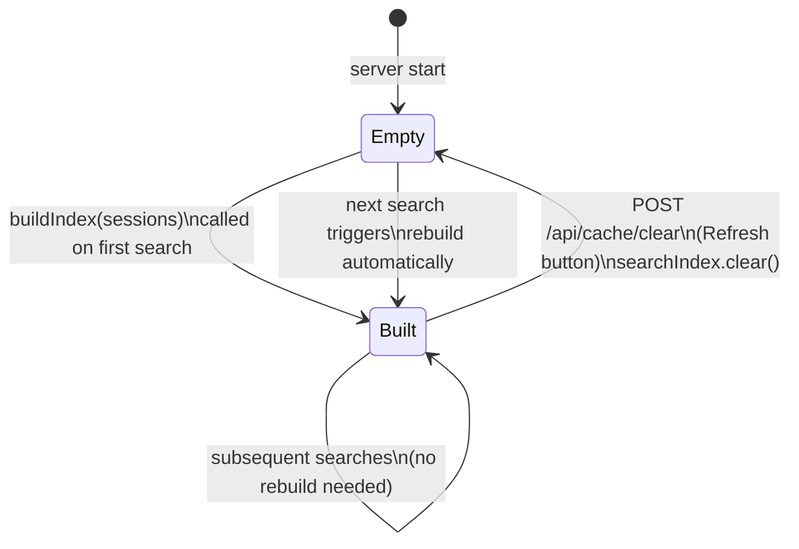

# Copilot Lens — Architecture Diagrams

## System Overview

```mermaid
graph TD
    Browser["Browser (SPA)"]

    subgraph Server["Express Server"]
        Routes["API Routes\n/api/sessions\n/api/search\n/api/analytics\n/api/insights"]
        Search["SearchIndex\nsearch.ts"]
        Sessions["sessions.ts"]
        VSCode["vscode-sessions.ts"]
        Cache["cache.ts\n30s TTL"]
    end

    subgraph Storage
        CLI["~/.copilot/session-state/\nworkspace.yaml + events.jsonl"]
        VS["VS Code globalStorage/\nstate.vscdb + {id}.json"]
    end

    Browser -->|HTTP| Routes
    Routes --> Search
    Routes --> Sessions
    Sessions --> VSCode
    Sessions --> Cache
    VSCode --> Cache
    Sessions --> CLI
    VSCode --> VS
    Search --> Sessions
```

---

## How Search Works

```mermaid
sequenceDiagram
    participant U as User
    participant JS as app.js
    participant API as /api/search
    participant SI as SearchIndex
    participant Ses as sessions.ts

    U->>JS: types query
    JS->>JS: debounce 300ms
    JS->>API: GET /api/search?q=...

    API->>Ses: listSessions() (cached)
    API->>SI: buildIndex(sessions)
    Note over SI: no-op if already built
    Note over SI: getSession() per session<br/>extract user + assistant messages<br/>strip code blocks

    API->>SI: search(query)
    Note over SI: tokenise query<br/>score each entry:<br/>  content freq / word count<br/>  +0.5 per title match<br/>  +0.2 per cwd match<br/>sort · filter · slice to limit<br/>extract highlight snippets

    SI-->>JS: [{entry, score, highlights}]
    JS-->>U: session cards with snippets

    U->>JS: clears search
    JS->>JS: restore normal list
```

---

## Search Index Lifecycle

```mermaid
stateDiagram-v2
    [*] --> Empty: server start

    Empty --> Built: buildIndex(sessions)\ncalled on first search

    Built --> Built: subsequent searches\n(no rebuild needed)

    Built --> Empty: POST /api/cache/clear\n(Refresh button)\nsearchIndex.clear()

    Empty --> Built: next search triggers\nrebuild automatically
```
